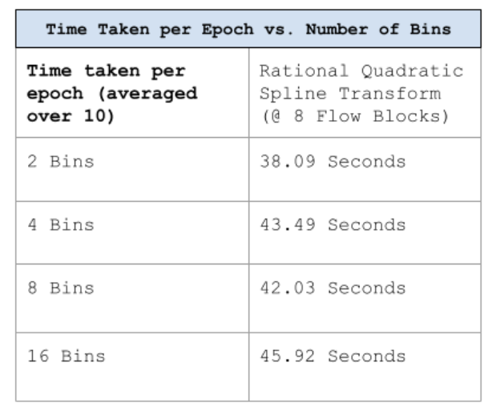

<!-- MathJax setup -->

# Neural Spline Flows in Transformer Autoregressive Models

By: Kristine Lu, Kshitij Sodani

## Introduction
Normalizing flows are a technique used in deep generative models that learn **invertible** mappings between a data distribution and a known reference distribution (typically a Gaussian). Recent state of the art image generative models center around diffusion, and research in the direction of normalizing flows has been left behind. However, when built on new architecture utilizing masked autoregressive vision transformer models, normalizing flows have shown to indeed be powerful image generative models [1]. One of the important choices when designing a normalizing flow is the choice of flow function. Our project tests the effectiveness of replacing the simple affine transformation of recent normalizing flow models with monotonic rational-quadratic spline transforms, essentially combining the flexibility of neural spline flows with the recent autoregressive masked ViT architecture to improve the ability of the model to capture complex transformations with fewer flow blocks.

  
  
<em>Normalizing Flows use invertible functions to map image distributions to normal distributions.</em>

## Background and Related Works
### Normalizing Flows

Many generative models in the context of image generation learn to map a data distribution to a simpler latent space representation, and then use samples drawn from the latent space along with a learnt mapping to bring images from the latent space back to the data distribution. 

For example, in a VAE, we have an "encoder" which learns a latent space representation of the data distribution, and then runs a new sample drawn from the latent space through a "decoder" to generate an image from the data distribution. The generator of a VAE maximizes the log likelihood $\mathbb{E}_{x \sim p_{data}}\log p_\theta(x)$ of a VAE, with $p_\theta(x) = \int_z p_\theta(x \mid z) p(z) dz$. However, the density $p(z)$ is intractable, so VAE's use a network to approximate the true posterior used to minimize ELBO losses.

That's where normalizing flows come in. Normalizing flows similarly learn to map a data distribution to a known distribution through a series of transformations, but they don't suffer from the non-exact posteriors of VAEs. The key idea here is invertibility: Invertibility allows us to easily compute the inverse of the transformations to generate images from samples in the latent space, without having to approximate the posterior distribution of latent variables by training a new network. Why is this useful? It avoids the looseness of ELBOs, is more stable and often converges faster, and can sample in a single pass through $f_\theta$ on a Gaussian, without the need for reweighting and iterative solvers.

But how exactly do we pick a framework for the flow function, so that our mapping from distribution $a$ to distribution $b$ is perfectly invertible, and the inverse easy to compute?

Let's mark out some notation and get some math out of the way. In the generative direction, we are trying to map some variable distribution $q_{simple}$ to some distribution $q_{wanted}$. Let $z \in q_{simple}$, $z' \in q_{wanted}$, and let $f$ be an invertible function such that $z' = f(z)$, and $g$ be its inverse such that $z= g(z')$. Using the change of variables formula, it's easy to see that the probability density function of the random variable $z'$ is:

$$q_{Z'}(z') = q_Z(z) |\det [\frac{\partial f^{-1}}{\partial z'}]|.$$

Intuitively, this means that the "probability mass is preserved", and the Jacobian determinant represents the *stretching* or *compressing* of the probability distribution. Above represents a generating flow, pushing a distribution from $z \in q_{simple}$ to $z' \in q_{wanted}$, since generally image patch distributions are more complex.

A single function $f$ is not expressive enough for the transformation of a simple to a complex distribution, so we let $f = f_i \circ \cdots \circ f_1$, the composition of $i$ functions, such that $f(z) = z'$. Thus we get as the determinant of the Jacobian of $f:$

$$\det |\frac{\partial f^{-1}}{\partial z'}| = \prod_{i = 1}^N \det |\frac{\partial f^{-1}_i}{\partial z_i}|,$$
where we denote $z_i = f_i \circ \cdots \circ f_1(z_0)$, where $z_0$ is from our initial distribution.

This determinant relationship makes the log-likelihood easy to calculate. We have $$\ln q_i(z_i) = \ln q_0(z_0) - \sum_{k = 1}^i \ln \mid \det \frac{\partial f_k} {\partial z_{k-1}} \mid.$$

Note that this is the generative flow from $z_0$ in some simple distribution to $z_k$ in some complex distribution.

To take the complex distribution back to the simple distribution, we simply do the same for the inverse $f^{-1}$, since we maintained that $f$ was perfectly invertible.

Usually, the simple distribution is a Gaussian while the complex one is a distribution of the data, which is why we call the flow from image distribution to latent space "normalizing flows". We train our model to map the image distribution to a Gaussian distribution, learn the best functions $f_i$ to do this, and then take the perfect inverse of these functions to map the Gaussian back to the image distribution.

Now, how do we parameterize the functions $f_i$ to be as expressive as possible, while still maintaining invertibility?

### Neural Spline Flows

There are two main methods of maintaining invertibility for normalizing flow functions in existing literature:

1. **Coupling Inputs**: In one flow step, we move from vector $(x)$ to $(y)$. We first split the input vector $(x) \rightarrow (x_1, x_2)$ into two halves, and we generate $\theta$ from $(x_1)$ only through a neural network. We then apply a chosen flow function $f_\theta$ to $(x_2)$ to get $(y_2)$. Then, the jacobian of this transformation is 

$
\begin{bmatrix}
I & * \\
0 & \frac{\partial f_\theta}{\partial x_2}
\end{bmatrix}
$

, where $\frac{\partial f_\theta}{\partial x_2}$ is diagonal because each coordinate in $(x_2)$ is transformed independently of all other coordinates. Thus, this Jacobian is perfectly invertible. In order to change the second half of the vector, we can take a permutation of the coordinates as a second function, which is also invertible.

2. **Autoregressive Mask**: Another way to maintain invertibility is to use an autoregressive mask, where we enforce that each new generated token only depends on previous tokens, so the Jacobian is lower triangular and thus invertible (we bound diagonal elements to be nonzero). A common form of this is described concretely. Let our data be a sequence of tokens $x_1, \cdots, x_n$. Let us take this sequence through some function $f$ to get a new sequence $y_1, \cdots, y_n$. Let the function $f$ have $y_i = f(x_i; x<i)$, where $x<i$ is the sequence of tokens $x_1, \cdots, x_{i-1}$, and the dimension $y_i$ is only dependent on all previous coordinates. Then, the matrix used to represent this transformation is lower triangular, and thus invertible as long as we enforce the diagonal elements to be nonzero.

In our work, we focus on the second method, because it is more compatible with the masked autoregressive vision transformer architecture.

Now, what function do we use?

One function we could use is an affine transformation, a simple, commonly used transformation in normalizing flows. It is defined as $f(x) = Ax + b$, where $A$ is a matrix and $b$ is a vector.

However, affine transformations are not very expressive because they are simple linear shifts, and it takes many flow blocks and many iterations for a model to learn the best affine transformation.

We turn to a more expressive and robust transformation, the rational-quadratic spline.

### Rational Quadratic Functions and Splines
A rational quadratic is a fraction where both the numerator and denominator are different quadratic equations.

#### Parametrization and Evaluation of a Rational Quadratic Spline.
We will define a spline with the domain as the [-B, B] range.

Intuitively, it can be visualized as K quadratic functions over disjoint ranges put next to each other in the xy plane. The resulting combination function should be continuous and strictly monotone. It should also be differentiable everywhere for backpropagation to work. The function being monotonous would enable us to invert the function which is a required property for transformation which enables a normalizing flow architecture to function.

  
  
<em>Here we've restricted the spline to the interval [–4, 4] (so B = 4) and used K = 3 bins, with knots at x = [–4, –1, 2, 4], corresponding y‐values [–4, –1, 1, 4] and derivative values [1, 0.5, 2, 1] at those knots</em>

Formally, for a Spline comprising of $K$ rational quadratic functions, the boundaries are set as $K+1$ coordinates $(x_k, y_k)$ for $k$ from $0$ to $K$ known as knots. Here $x_i$ and $y_i$ are both monotonic sequences with $x_0 = y_0 = 0$ and $x_K = y_K = B$. 

We try to force certain derivatives at the $K-1$ intermediate boundary points $x_i = y_{i+1}$ for $i = 2$ to $K$. Let the derivative at $x_{i+1}$ be $\sigma_i$.

We set the boundary derivatives at $x_0$ and $x_K$ to be $1$ to make it like a linear tail.

Now, it turns out we can always construct rational quadratic functions of $K$ such that the derivative constraints are satisfied and the resulting spline is monotonic, differentiable and continuous everywhere. On the other hand, it is not possible to match arbitrary values and
derivatives of a function at two boundary knots with a quadratic polynomial or a monotonic segment of a cubic polynomial.

Define $s_k = \frac{y_{k+1} - y_k}{x_{k+1} - x_k}$ and $\xi(x) = \frac{x - x_{k}}{x_{k+1} - x_{k}},$

The expression for $\frac{\alpha^{(k)}(\xi)}{\beta^{(k)}(\xi)}$ in the $k^\text{th}$ bin can be written
$$y^{(k)} + \frac{(y^{(k+1)} - y^{(k)}) \left[ s^{(k)} \xi^2 + \delta^{(k)} \xi (1 - \xi) \right]}{s^{(k)} + \left[ \delta^{(k+1)} + \delta^{(k)} - 2s^{(k)} \right] \xi (1 - \xi)}.$$

Using the quotient rule, we get an expression for the derivative as follows:

  

#### Claim: This composition of rational quadratics is invertible, monotone and continuous.

**Proof**: It is easy to see that the derivative is always more than zero because of the squared expressions and the fact that $\xi$ is between $0$ and $1$, atleast one of $\xi$ and $1-\xi$ is positive and $s_k$ and $\sigma_k$ are all non-negative. Hence the function is monotone and hence invertible. Substituting $\xi = 0$ and $\xi = 1$, we also get the derivatives at the boundaries. are $\sigma_k$ and $\sigma_{k+1}$ as required.

Clearly the function is continuous as each rational quadratic is differentiable at each point in its range, the derivatives at common boundaries are same for any two neighboring rational quadratic expressions and the fact that the union of all the rational functions range is the function range $[-B,B]$.

To evaluate the function for a fixed $x$, we can first do a binary search to find the largest $k$ such that boundary point $x_k \leq x$ and then evaluate the rational quadratic function of the $(k+1)$th bin on $x$.

It turns out the co-domain of this construction is also $[-B,B]$ so we don't need to re-normalize anything.

Since the rational quadratic function acts independently of all the values, the log of the Jacobian matrix can be just computed by taking the sum of the logs of the derivatives of each of the transformed $x$ values. So we can just sum up all the derivatives individually using the formulae mentioned above.

Clearly, the spline is much more expressive than an affine transformation as it can be much closer to random functions we might want to model. This can also significantly reduce the number of blocks needed in the normalizing flow while keeping same quality or drastically increase quality if the number of blocks is unchanged.

#### Inverting a rational quadratic function:

This reduces to solving a quadratic equation in $\xi$ if y is constant. There are 2 possible solutions but with our construction only of them lies in the functions bin(lower bin boundary to the upper bin boundary). This is true as the spline is strictly monotone so it cannot have the same value at 2 places.

#### Implementation Details as per the Neural Spline Flows Paper:

The monotonic rational-quadratic coupling transform is implemented in practice as follows:

  
  
<em></em>

## Method
We use the architecture of the TarFlow model, a vision-transformer based autoregressive model, to build our normalizing flow with a spline transformation.

  
  
<em>Transformer autoregressive Model, Forward (image to latent space) pass</em>

The model works as follows:

1. We take an image, patchify it into a sequence of image patches, and pass each image patch through a sequence of transformer encoder layers to get a latent representation, using a masked auto-regressive vision transformer. Our input is a sequence of image patches $[B, H, W, C]$ (batch size, height, width, channels), patchified to $[B, T, D]$ (batch size, number of patches, dimension of patch).

2. We input our patchified image into a transformer encoder, which takes self-attention. We use the outputs of the transformer layers (which are autoregressively masked) as the parameters of the spline transformation. (We project the outputs of the transformer to the dimension $(3 \cdot \textnormal{number of bins} - 1)$ to match the dimension of the spline transformation.)

3. To train the model to learn to map our image distribution to a Gaussian distribution, we attempt to maximize the log likelihood, thus miniminizing the following:

   $$\begin{align*}
   \mathcal{L}(\theta) &= \mathbb{E}_{x \sim p_{data}} [\log p_\theta(x)], \\
   \log p_\theta(x) &= \log p(z) + \sum_{k = 1}^T \log |\det \frac{\partial f_\theta ^{(k)} (z_{k-1})}{\partial z_{k-1}}|.
   \end{align*}$$

   The first term, we call the Gaussian prior term, which is, up to constants, $-\frac{1}{2} \lVert z \rVert^2$, for a standard normal prior latent distribution. 

   The second term is the log determinant of the Jacobian of our spline transformation, which we can compute analytically since each autoregressive block is lower-triangular. 

   Our loss function is then 
   $$\textnormal{Gaussian Prior Term} - \textnormal{Logdet Loss}.$$
   
   Intuitively, this makes sense, since we want to push our distribution data to be as close to the "peak" of the Gaussian as possible, and to prevent it from collapse to zero, we add a logdet loss to maximize the amount each transformation stretches the volume of the latent space.

4. We then sample from the Gaussian distribution to get a new latent representation, and pass it through the inverted spline transformation to get a new image patch.

  
  
<em>Transformer autoregressive model, Reverse (generative) pass</em>

In order to do that, we had to normalize data within the spline using a softmax layer and a softplus for the derivative (both of these are invertible), because it takes inputs in the range [-B, B], and outputs data in the range [-B, B].

Also, because our transformer weights are the parameters of our spline transformation, we can't simply invert the spline transformation to get the image patch back, because inverting the matrices in our transformer would be far too computationally expensive.

So, we use the following trick:

We manually make the spline transformation about the first patch (along the sequence dimension) the identity function regardless of the original parameters of our spline. This means we concatenate a vector of zeros, an shift the remaining parameters of the spline to the next sequence dimension. If we input all zeros as parameters of our spline, the softmax will output equal-width, equal-distance, and derivatives of 1, so we have the identity function, so that when the first patch passes through the transformer, it comes out unchanged. Then, because the transformer is masked autoregressive, the generation of the second patch is conditioned on the first patch, which is the same as in the original image. Because each new patch is conditioned on all previous patches, which were the same as in the original image, we have perfect invertibility.

## Experiments

We base the performance of our model compared to the affine transformation on the following metrics:

1. The log determinant of the Jacobian of the transformation, which we can compute analytically since each autoregressive block is lower-triangular. 

  
  
<em>Gaussian Prior Loss from a 8-block RQS 100-epoch run</em>

  
  
<em>Logdet Loss from a 8-block RQS 100-epoch run</em>

  
  
<em>Total Loss from a 8-block RQS 100-epoch run</em>

We calculated the logdet loss, total loss, and Gaussian prior loss over 100 epochs for a 8-bin RQS model, a 4-bin RQS model, and an affine transformation model, each with 8 flow blocks.

  
  
<em>Affine vs. RQS normalized losses</em>

Our results showed that the affine functions were able to learn more due to a higher logdet loss, while the RQS model was able to learn a more compressed Gaussian distribution. This doesn't directlty translsate to the affine transformation being more expressive than the RQS model, because the logdet loss is not the only metric we care about. We also care about the quality of the generated images.

  
  
<em>Selected digits (conditioned from 0-9) generated from our 8-bin RQS run after 100 epochs</em>

We noticed that the first two patches and the last two patches of each image produced were significantly more noisy than the rest of the image. This is because in our model, the first patch is always passed through as the identity function in order to preserve invertibility. To fix this, we flip our patch order every block. However, this still means that the first few patches and the last few patches are attended to approximately half as much as the rest of the image, resulting in their noisiness after many epochs.

We also benchmarked the number of flow steps of both models. Our model had more parameters to learn compared to the affine transformation, so we wanted to see how few flow steps compared to the affine transformation we could get away with while still achieving good results.

  
  
<em>RQS vs. Affine Transform efficiency (seconds per epoch)</em>

Much of the computation/backpropagation cost in our transformer model came from back-propagating through the transformer, due to the sheer number of parameters and matrix multiplications.

Back-propagating and passing through the rational quadratic spline and transform takes longer than through the affine transform, because the rational quadratic spline takes in more parameters (3*num_bins - 1) and is a more complex function, but it takes a small number of extra FLOPS compared to a highly expressive transformer.

Thus, we are able to get a larger expressivity and robustness with a runtime scaled by a small constant, as seen in the table above. For K=8 we notice that the runtime for the spline is around double than the affine transformation (mentioned in the table). Intuitively, if we think about it, the spline is much much more expressive than an affine transformation and hence the tradeoff is in favor of the spline as we have to attach way way fewer flow blocks to get the same performance as an affine transformation with more blocks.

Furthermore, because rational quadratic spline transforms are nonlinear, we are able to use fewer flow blocks to achieve the same level of expressiveness, further speeding up runtime.

  
  
<em>Time taken per epoch vs. Number of bins used</em>

We also performed analysis on the number of bins needed. Essentially, the larger the number of bins, the more robust our model is to variance in pixels at all patches. Choosing K as a small constant like 4 or 8 is good enough to give good results. We obviously cannot choose K very high (like 100) as that would lead to a huge constant factor.  Increasing the number of bins a little bit might be useful in more complex datasets like Imagenet. We haven't tested yet on more complex datasets due to compute bottlenecks.

We conclude that our model is able to learn a representation and generate images well, with a runtime that is only a constant factor slower than an affine transformation. We conjecture that our model is more robust than an affine transformation, since each piecewise function allows more specificity given a more varied input distribution. 

#### Limitations:

We were heavily limited by compute, with very little access to GPUs. Thus, we were only able to train on a few epochs, few selection of hyperparameters small models, and only on a small dataset MNIST. Because of this, we were also not able to run as many experiments and tested as many ablations and hyperparameters as we would have liked. However, there are other experiments we would have liked to run, which we discuss here.

#### Future Works:

- **Scale to Larger Datasets**: We would like to test on larger datasets like CIFAR-10, CelebA, and subsets of ImageNet. Theoretically, our model should excel on datasets with large variance in pixel values, like ImageNet, versus MNIST, because of its piecewise nature. 

- **Permutations**: We would like to test different permutations of the patch order, and see if they yield better results. We ran into the issue above of the first and last few patches being particularly noisy, so we would like to see if different sequence permutations (instead of flipping the order each block) yield better results.

- **Testing New Functions**: Taking inspiration from quadratic splines, we would like to text other complex invertible monotonic functions, and see if they can be both expressive and efficient, instead of sticking to simple affine transformations as the status quo.

- **Parameter Testing and Scaling Laws**: We would like to benchmark how the number of flow steps, layers, blocks, and bins can affect the performance of our model. We would like to find scaling laws, especially for the number of block layers.

- **Interpretibility**: Having the exact marginal posterior distribution of latent variables combined with expressive generations opens the door to interpretibility, seeing where in latent spaces features lie. This would be an interesting direction to explore.

## References

[1]: Conor Durkan, Artur Bekasov, Iain Murray, and George Papamakarios. *Neural Spline Flows*. Advances in Neural Information Processing Systems, 2019. [arXiv:1906.04032](https://arxiv.org/abs/1906.04032)

[2]: Shuangfei Zhai, Ruixiang Zhang, Preetum Nakkiran, et al. *Normalizing Flows are Capable Generative Models*. arXiv preprint, 2024. [arXiv:2412.06329](https://arxiv.org/abs/2412.06329)

[3]: Danilo Jimenez Rezende and Shakir Mohamed. *Variational Inference with Normalizing Flows*. arXiv preprint, 2015. [arXiv:1505.05770](https://arxiv.org/abs/1505.05770)

